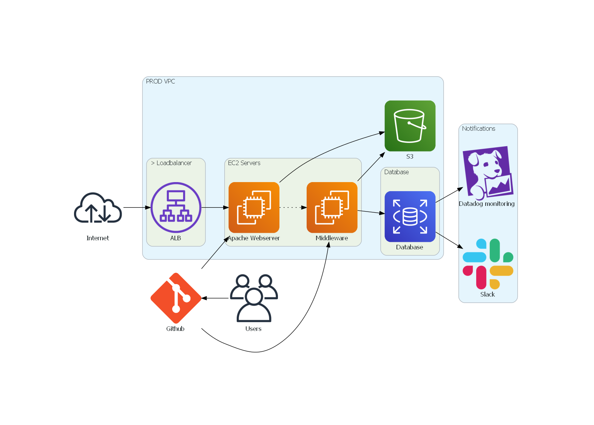

## Diagrams
# diagramex.py
* Just a example diagram for testing purposes, nothing less
# 
* The code for the diagram and the output
# diagramproject2.py and diagrams_image2.png
* The same code and same output but with colored arrows
